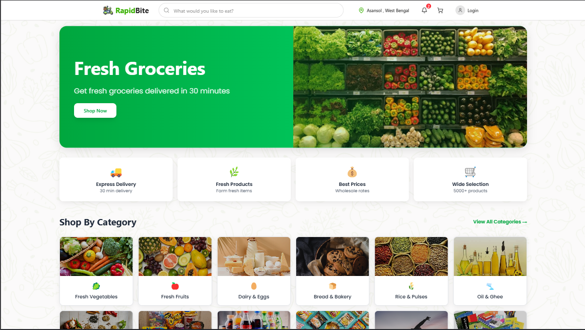
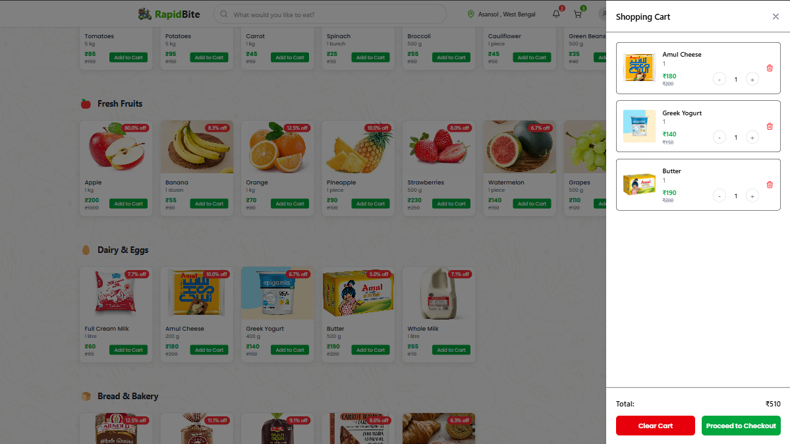
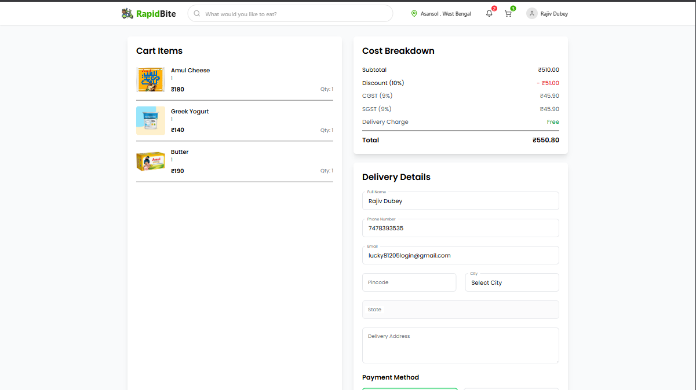
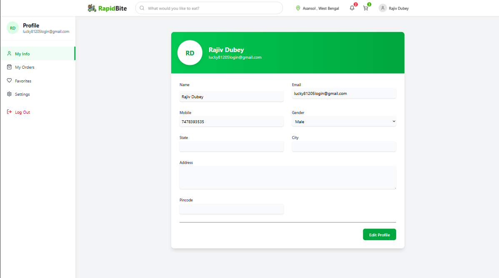

# RapidBite 🛒

A modern, full-stack e-commerce platform for fresh groceries with real-time delivery tracking and a seamless shopping experience./*

---

## 🌟 Features

### User Features
- **User Registration & Authentication**: Secure login and signup with JWT.
- **Profile Management**: Update personal details and manage addresses.
- **Order History**: View past orders with detailed summaries.
- **Wishlist Management**: Save favorite products for later.
- **Real-time Order Tracking**: Track orders with a dynamic status timeline.
- **Address Management**: Add, edit, and delete delivery addresses.
- **Payment Methods**: Manage payment options securely.
- **Order Cancellation**: Cancel orders before they are shipped.
- **Product Reviews & Ratings**: Share feedback on purchased products.

### Admin Features
- **Dashboard Analytics**: View sales, orders, and user statistics.
- **Product Management**: Add, update, and delete products.
- **Category Management**: Organize products into categories.
- **Order Management**: Update order statuses and manage deliveries.
- **User Management**: Manage user accounts and permissions.
- **Inventory Tracking**: Monitor stock levels and receive alerts.
- **Promotional Campaigns**: Create and manage discounts and offers.
- **Delivery Partner Management**: Assign and track delivery partners.
- **Sales Reports**: Generate detailed sales reports.
- **Feedback Management**: Review and respond to customer feedback.

### Product Features
- **Category-based Browsing**: Navigate products by categories.
- **Search Functionality**: Quickly find products with a search bar.
- **Filtering & Sorting**: Filter by price, rating, and more.
- **Real-time Inventory Updates**: See live stock availability.
- **Product Recommendations**: Get personalized suggestions.
- **Price History Tracking**: View historical price trends.
- **Bulk Import/Export**: Manage products in bulk.
- **Product Variants**: Handle multiple sizes, colors, etc.
- **Stock Alerts**: Get notified when stock is low.
- **Product Analytics**: Analyze product performance.

### Cart Features
- **Dynamic Cart Management**: Add, remove, and update items in real-time.
- **Quantity Adjustment**: Modify item quantities easily.
- **Price Calculation**: Automatic total price updates.
- **Checkout Process**: Smooth and secure checkout experience.
- **Save Cart for Later**: Save items for future purchases.
- **Share Cart**: Share your cart with others.
- **Bulk Item Addition**: Add multiple items at once.
- **Cart Recovery**: Recover abandoned carts.
- **Discount Codes**: Apply promo codes for discounts.

---

## 🛠️ Tech Stack

### Frontend
- **React.js**: Component-based UI library.
- **Vite**: Fast development build tool.
- **TailwindCSS**: Utility-first CSS framework.
- **Framer Motion**: Smooth animations and transitions.
- **React Router**: Client-side routing.
- **Firebase**: Authentication and cloud storage.
- **SweetAlert2**: Beautiful alert popups.

### Backend
- **Node.js**: JavaScript runtime for server-side development.
- **Express.js**: Web framework for building APIs.
- **MongoDB**: NoSQL database for data storage.
- **JWT Authentication**: Secure user authentication.
- **Bcrypt**: Password hashing for security.

---

## 🚀 Getting Started

### Prerequisites
- **Node.js** (v14 or higher)
- **MongoDB**
- **npm** or **yarn**

### Installation

1. **Clone the repository**
   ```bash
   git clone https://github.com/RJIV81205/rapidbite.git
   cd rapidbite
   ```

2. **Install dependencies**
   ```bash
   npm install
   ```

3. **Set up environment variables**
   - Create a `.env` file in the server directory with the following variables:
     ```env
     MONGODB_URI=your_mongodb_uri
     JWT_SECRET=your_jwt_secret
     PORT=5000
     ```

4. **Start the development servers**
   ```bash
   npm run dev
   ```

   - Frontend: [http://localhost:5173](http://localhost:5173)
   - Backend: [http://localhost:5000](http://localhost:5000)

---

## 📁 Project Structure

```
rapidbite/
├── client/                 # Frontend React application
│   ├── src/
│   │   ├── components/    # Reusable UI components
│   │   ├── pages/         # Page components
│   │   ├── context/       # React context providers
│   │   └── constants/     # Constants and configurations
│   └── public/            # Static assets
├── server/                 # Backend Node.js application
│   ├── controllers/        # Route controllers
│   ├── models/             # Database models
│   ├── routes/             # API routes
│   └── middleware/         # Custom middleware
└── package.json            # Root package.json
```

---

## 📸 Screenshots

### User Interface
- **Home Page**  
  

- **Shopping Cart**  
  

- **Checkout Process**  
  

- **Order Tracking**  
  

- **User Profile**  
  

### Admin Dashboard
- **Analytics**  
  

  - **Product Management**  
  

- **Order Management**  
  


**Happy Shopping! 🛍️**

