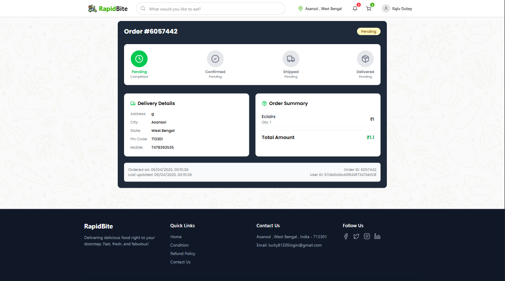
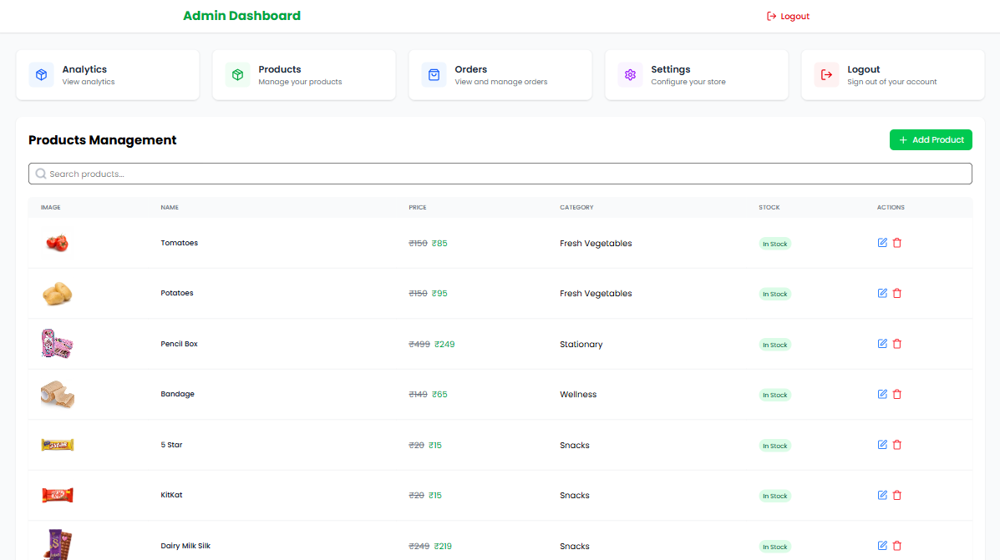
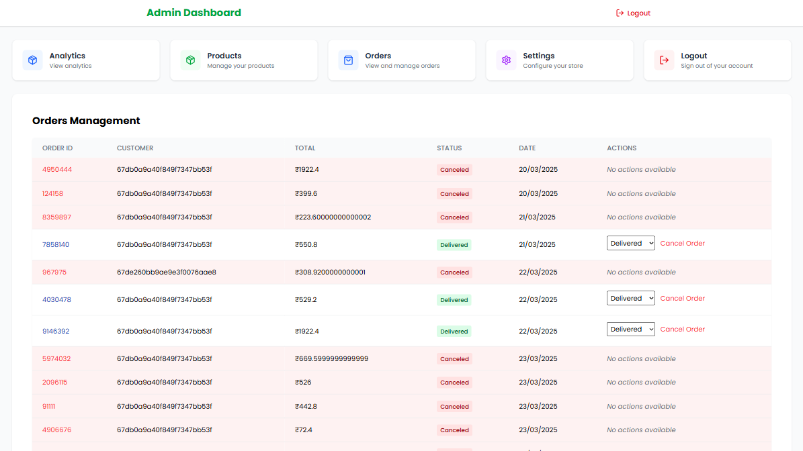
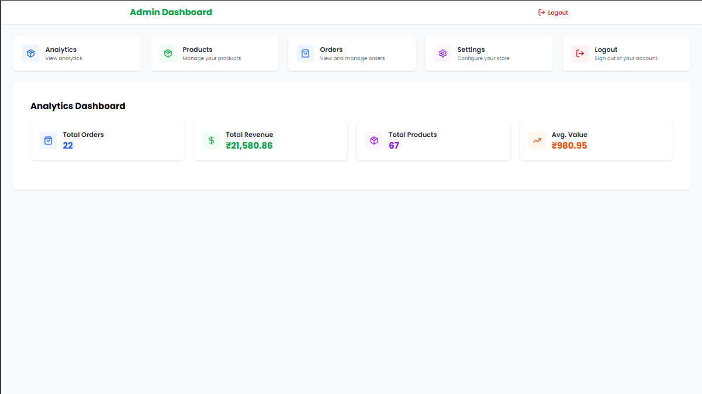

# RapidBite 🛒

A modern, full-stack e-commerce platform for fresh groceries with real-time delivery tracking and a seamless shopping experience.

## 🌟 Features

- **Modern UI/UX**: Beautiful and responsive design with smooth animations
- **Real-time Shopping**: Live product updates and inventory management
- **Secure Authentication**: User authentication with JWT
- **Shopping Cart**: Dynamic cart management with real-time updates
- **Category-based Navigation**: Easy browsing through product categories
- **Promotional System**: Special deals and discounts
- **Express Delivery**: 30-minute delivery promise
- **Quality Assurance**: Carefully selected and quality-checked products

## 🛠️ Tech Stack

### Frontend
- React.js
- Vite
- TailwindCSS
- Framer Motion (for animations)
- React Router
- Firebase
- SweetAlert2

### Backend
- Node.js
- Express.js
- MongoDB
- JWT Authentication
- Multer (for file uploads)
- Bcrypt (for password hashing)

## 🚀 Getting Started

### Prerequisites
- Node.js (v14 or higher)
- MongoDB
- npm or yarn

### Installation

1. Clone the repository
```bash
git clone https://github.com/yourusername/rapidbite.git
cd rapidbite
```

2. Install dependencies
```bash
npm install
```

3. Set up environment variables
Create a `.env` file in the server directory with the following variables:
```env
MONGODB_URI=your_mongodb_uri
JWT_SECRET=your_jwt_secret
PORT=5000
```

4. Start the development servers
```bash
npm run dev
```

This will start both the frontend and backend servers concurrently:
- Frontend: http://localhost:5173
- Backend: http://localhost:5000

## 📁 Project Structure

```
rapidbite/
├── client/                 # Frontend React application
│   ├── src/
│   │   ├── components/    # Reusable UI components
│   │   ├── pages/        # Page components
│   │   ├── context/      # React context providers
│   │   └── constants/    # Constants and configurations
│   └── public/           # Static assets
├── server/               # Backend Node.js application
│   ├── controllers/     # Route controllers
│   ├── models/         # Database models
│   ├── routes/         # API routes
│   └── middleware/     # Custom middleware
└── package.json         # Root package.json
```

## 🔒 Environment Variables

### Frontend (.env)
```env
VITE_BACKEND_URL=http://localhost:5000
```

### Backend (.env)
```env
MONGODB_URI=your_mongodb_uri
JWT_SECRET=your_jwt_secret
PORT=5000
```

## 📱 Features in Detail

### User Features
- User registration and authentication
- Profile management
- Order history
- Wishlist management
- Real-time order tracking
- Address management
- Payment method management
- Order cancellation
- Product reviews and ratings

### Admin Features
- Dashboard with sales analytics
- Product management (CRUD operations)
- Category management
- Order management and status updates
- User management
- Inventory tracking
- Promotional campaign management
- Delivery partner management
- Sales reports generation
- Customer feedback management
- System settings configuration

### Product Features
- Category-based browsing
- Search functionality
- Product filtering and sorting
- Real-time inventory updates
- Product recommendations
- Price history tracking
- Bulk product import/export
- Product variants management
- Stock alerts
- Product analytics

### Cart Features
- Add/remove items
- Quantity adjustment
- Price calculation
- Checkout process
- Save cart for later
- Share cart functionality
- Bulk item addition
- Cart recovery
- Price comparison
- Discount code application

## 📸 Screenshots

### User Interface





### Admin Dashboard






